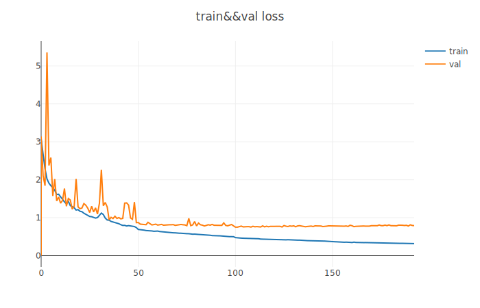

# ResneXt
resneXt融合了inception的多分支结构和resnet的残差连接。inception模块中的每个分支使用了不同的kernel_size或不同的operation使得特征融合了多尺度信息等，提高特征的表达能力。而resnet模块则通过残差连接来解决梯度消失的问题，减轻训练模型的难度，也使得deep neural network的训练成为可能。这两者主要分别从cardinality和deep两个不同的dimension来提高模型的表达能力。与inception不同，resnext的多分支结构的每一条分支都具有相同的拓扑结构。为了方便实现，在这里我们可以采用组卷积的方式来模拟多分支结构。此次，我使用了cifar10数据集来分别训练resnet50和resnext两个网络。resnext主要是在resnet50上增加了组卷积操作。由于受到数据集中图像大小的限制，我移除了resnet50中卷积网络的最后一层。
# Environment
python 3.7  
pytorch 1.5  
torchvision 0.6  
opencv 3.4
# Result
resnet50模型的学习曲线和测试准确率如下图所示:    

  
resnext模型的学习曲线和测试准确率如下图所示:  

  
从图中可知，resnet50的准确率优于resnext。但是这并代表resnext的性能逊色于resnet。从resnext的学习曲线可知，模型的训练Loss还有下降的可能。但是由于电脑只有单卡而且无法多程序加载数据集，所以我并没有增加训练的epoch。从上面的accuracy可知，resnet和resnext两者在测试集上的准确率均偏低，这很有可能是模型并没有充分训练好所导致的结果，也有可能是模型本身的泛化能力差。所以，这也是接下来我需要研究的问题，如何训练好一个模型以及如何提高模型的泛化能力。

